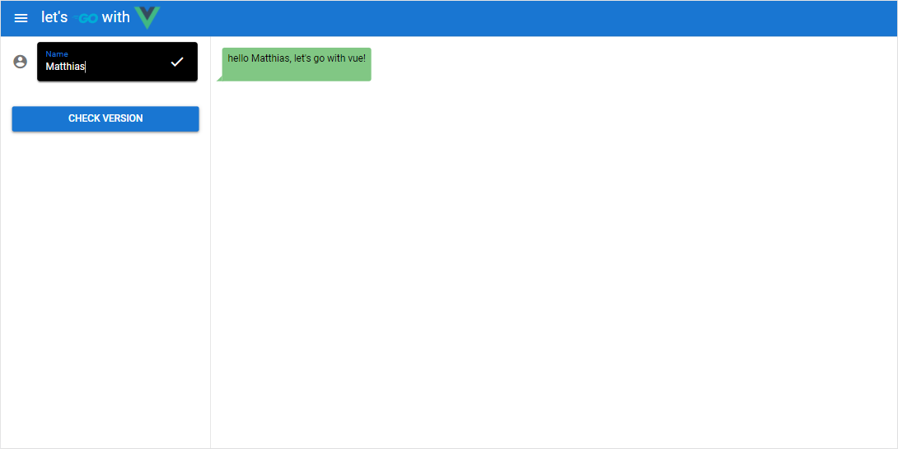

# Let's go with vue

The project show's how I've set up a very simple, exemplary [*GO*](https://golang.org/) application using [*Vue.js*](https://vuejs.org/) and the [*Quasar*](https://quasar.dev/) framework as frontend. My intention was that the built application still consists of single binary and serves all needed UI's html and javascript files with an embedded webserver so that it can be accessed by just opening it's address and port in a browser.

Besides I tried to completely avoid and CLI tools or bundlers for creating the UI. Instead ES Modules are used that most browsers support these days (for this, Arswaw's [article](https://dev.to/arswaw/create-a-lightweight-componentized-spa-without-node-569j) was a great help and inspiration).

## Getting started

After cloning the project, it can be just compiled by

```shell
$ go generate
go: downloading github.com/go-chi/chi v1.5.1
go: downloading github.com/go-chi/cors v1.1.1
go: downloading github.com/shurcooL/vfsgen v0.0.0-20200824052919-0d455de96546
go: downloading github.com/shurcooL/httpfs v0.0.0-20190707220628-8d4bc4ba7749
$ go build
```

As you can see the `go generate` step creates a virtual filesystem that contains all the UI sources that will be served by the application's webserver. After valling `go build` the binary (`go-vue`) should be created.

It can be started with the following command line parameters:

* // TODO: Implement command line parameters at least for listening address and port



## Project Structure

| Directory      | Purpose                                                                                 |
| -------------- | --------------------------------------------------------------------------------------- |
| *assets/webui* | UI files that will be embedded in a virtual filesystem                                  |
| *doc/images*   | Images that are used in this readme.md                                                  |
| *internal/api* | Internal go package containing the applcocation's API implementation that is used by UI |
| *internal/log* | Internal log package for tracing and log output                                         |
| *internal/vfs* | Implementation to generate the UI's virtual filesystem                                  |
