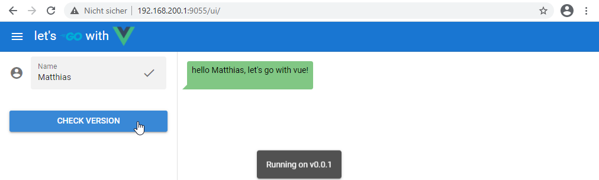

# Let's go with vue

The project shows how I built a very simple, example [*GO*](https://golang.org/) application using [*Vue.js*](https://vuejs.org/) and the [*Quasar*](https://quasar.dev/) framework as the frontend. My intention was to have the built application consist of only a single binary and serve all the required user interface html and javascript files with an embedded web server, so that it can be accessed by simply opening the address and port in a browser.

I also tried to completely avoid using CLI tools or bundlers to build the UI. Instead, ES (ECMAScript) modules are used, which are supported by most browsers nowadays (for this, Arswaw's [article](https://dev.to/arswaw/create-a-lightweight-componentized-spa-without-node-569j) was a great help and inspiration).

## Getting started

After cloning the project, it can be just compiled by:

```shell
$ go generate
go: downloading github.com/go-chi/chi v1.5.1
go: downloading github.com/go-chi/cors v1.1.1
go: downloading github.com/shurcooL/vfsgen v0.0.0-20200824052919-0d455de96546
go: downloading github.com/shurcooL/httpfs v0.0.0-20190707220628-8d4bc4ba7749
$ go build
```

As you can see the `go generate` step creates a virtual filesystem that contains all the UI sources that will be served by the application's webserver. After valling `go build` the binary (`go-vue`) should be created.

After starging the application, it will listen on port 9055:

```shell
$ ./go-vue 
INFO:  2021/01/10 14:04:04 Web UI listening on: :9055
```



The application's API only contains 3 methods:

* **titlePrefix**: Returns the title's prefix (here `let's`). This is called when the UI page is loaded.
* **setName**: Sets the user name and returns a messsage that contain's the user name. This is called when either enter is pressed after entering a name or when the check mark was pressed.
* **version**: Returns the current application's version. This is called when the *CHECK VERSION* button is pressed and opens a notification with the version number.

Calling these API methods is implemented in UI's [`api.js`](assets/webui/api.js).

## Project Structure

| Directory      | Purpose                                                                                 |
| -------------- | --------------------------------------------------------------------------------------- |
| *assets/webui* | UI files that will be embedded in a virtual filesystem                                  |
| *doc/images*   | Images that are used in this readme.md                                                  |
| *internal/api* | Internal go package containing the applcocation's API implementation that is used by UI |
| *internal/log* | Internal log package for tracing and log output                                         |
| *internal/vfs* | Implementation to generate the UI's virtual filesystem                                  |
